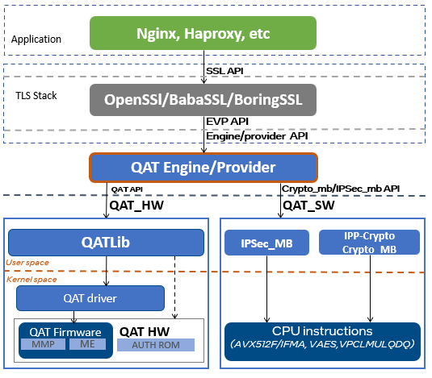

# Intel&reg; QuickAssist Technology(QAT) OpenSSL\* Engine
Intel&reg; QuickAssist Technology OpenSSL\* Engine (QAT_Engine) supports
acceleration for both hardware as well as optimized software based
on vectorized instructions. This change starting with the 3rd Generation
Intel&reg; Xeon&reg; Scalable Processors family provides users more options to
accelerate their workloads. The QAT OpenSSL\* engine now supports the ability
to accelerate from the stand OpenSSL\* to basic Intel instruction set, to either
Hardware acceleration path (via the qat_hw path) or via the optimized SW path
(qat_sw lib). This document details the capabilities and interfaces for both
internal libraries which maintaining the cohesiveness of being all packaged
up with the QAT_Engine.

The image below illustrates the high-level software architecture of the
QAT_Engine. Applications such as NGINX and HAProxy are common applications
which interfaces to OpenSSL\*. OpenSSL\* is a toolkit for TLS/SSL protocols and
has developed a modular system to plugin device-specific engines starting
with  version 1.1.0. As mentioned above, within the QAT_Engine are two separate
internal entities by which acceleration can be performed. Depending on your
particular use case, the QAT_Engine can be configured to meet your specific
acceleration needs. This document details the capabilities of the QAT engine
as well as the limitations. Both the hardware and software requirements are
explained followed by detailed instructions how to install QAT_Engine. If you
have any issues integrating the QAT_Engine, we’ve added a troubleshooting
section.

<p align=center>

</p>

## Features
Features of the QAT_Engine are described [here](docs/features.md).

## Limitations
Limitations for the QAT_Engine are described [here](docs/limitations.md).

## Requirements
- [Hardware Requirements](docs/hardware_requirements.md)
- [Software Requirements](docs/software_requirements.md)

## Installation Instructions
Installation consists of the following:
<details>
<summary markdown="span">Install Prerequisites</summary>

<details>
<summary markdown="span">qat_hw Prerequisites </summary>

<br> Install the Intel&reg; QuickAssist Technology Driver using instructions from the Getting Started Guide

| Platform   |    Getting Started Guide |
|----|   -|
|Intel&reg; Xeon&reg; with Intel&reg; C62X Series Chipset<br>Intel&reg; Atom&trade; Processor <br> Intel&reg; Communications Chipset 8925 to 8955 Series:|Intel&reg; QuickAssist Technology Software for Linux\* - [Getting Started Guide - HW version 1.7 (336212)](https://01.org/sites/default/files/downloads/336212007qatswgsg.pdf) |

Other technical collaterals of the Intel&reg; QuickAssist Technology driver
can be found in the below 01.org page.
- [Intel&reg; QuickAssist Technology](https://01.org/intel-quickassist-technology)

## Contiguous memory driver

The Intel&reg; QAT API requires many of the data structures (those that will be
passed to the hardware) to be allocated in contiguous pinned memory in order to
support DMA operations. You must either supply your own contiguous memory driver
and make changes to the engine to make use of it or use one of the following
drivers:

### User Space DMA-able Memory (USDM) Component

The Intel&reg; QAT Driver HW Version 1.7 comes with its own
contiguous pinned memory driver that is compatible with the Intel&reg; QAT
OpenSSL\* Engine. The USDM component is of a higher quality than the
qat\_contig\_mem driver provided within the Intel&reg; QAT OpenSSL\* Engine,
and is the preferred option. The USDM component is used by the Intel&reg; QAT
Driver HW Version 1.7 itself, and also has the following additional features:

* Support for virtualization
* Support for configurable slab sizes
* Support for configurable secure freeing of memory (overwrite with zeros)
* Support for configurable slab caching
* Support for newer kernels

The USDM component is located within the Intel&reg; QAT Driver HW Version 1.7
source code in the following subdirectory: `quickassist/utilities/libusdm_drv`.
As the USDM component is also used by the 1.7 driver itself it will have
already been built when the driver was built. It may also already be loaded as
well, and you can check by running `lsmod` and looking for usdm_drv in the list.
If not present it can be loaded as follows:

```bash
modprobe usdm_drv.ko
```

#### Example contiguous memory driver - qat\_contig\_mem

This step is not required if using the default USDM driver above. The Intel&reg;
QAT OpenSSL\* Engine comes with an example kernel space contiguous memory driver
that can be used to try out operation of the engine. It is considered to be an
example only and is not written to be a production quality driver.
The use of the qat\_contig\_mem driver can be enabled using the configure
option `--enable-qat_hw_contig_mem` that tells the build that the Intel&reg;
QAT OpenSSL\* Engine should be compiled to use the qat_contig_mem component
instead of the USDM memory driver above.

Building and loading the qat_contig_mem driver assumming:

* The Intel&reg; QAT OpenSSL\* Engine was cloned to its own location at the
  root of the drive: `/`.

To build/install the qat\_contig\_mem driver follow these steps:

```bash
cd /QAT_Engine/qat_contig_mem
make
make load
make test
```

The expected output from `make test` should be something similar to the
following:

    seg mapped to 0x7f9eedd6e000, virtualAddress in seg 0xffff880ac9c0c000,
    length 64
    Hello world!
    # PASS Verify for QAT Contig Mem Test

</details>
<details>
<summary markdown="span">qat_sw Prerequisites<br></summary>

- Verify qat_sw components are installed as described in [Sofware requirements](docs/software_requirements.md#qat_sw-requirements)

</details>
</details>
<details>
<summary>Install OpenSSL*    (Note this step is not required if OpenSSL* 1.1.1 is already installed)</summary>

## Build OpenSSL\*

This step is not required if building the Intel&reg; QAT OpenSSL\* Engine
against system prebuilt OpenSSL\* 1.1.1. When using the prebuild system OpenSSL library
the engine library is installed in the system OpenSSL engines directory.

Clone OpenSSL\* from Github\* at the following location:

    git clone https://github.com/openssl/openssl.git

It is recommended to checkout and build against the OpenSSL\* 1.1.1 git tag
specified in the release notes.
Versions of OpenSSL\* before OpenSSL\* 1.1.0 are not supported.

Due to the nature of the Intel&reg; QAT OpenSSL\* Engine being a dynamic engine
it can only be used with shared library builds of OpenSSL\*.

Note: The OpenSSL\* 1.1.0 and 1.1.1 baselines build as a shared library by
default now so there is no longer any need to specify the `shared` option when
running `./config`.

Note: It is not recommended to install the accelerated version of OpenSSL\* as
your default system library. If you do, you may find that acceleration is used
unexpectedly by other applications on the system resulting in
undesired/unsupported behaviour. The `--prefix` can be used with the `./config`
command to specify the location that `make install` will copy files to. Please
see the OpenSSL\* INSTALL file for full details on usage of the `--prefix`
option.

With OpenSSL\* version 1.1.0 and on, binaries are installed in standard
directories by default, and the addition of runpath directories is not done
automatically.  If you wish to install OpenSSL\* in a non-standard location
(recommended), the runpath directories can be specified via the OpenSSL\*
Configure command, which recognises the arguments `-rpath` and `-R` to support
user-added rpaths.  For convenience, a Makefile variable `LIBRPATH` has also
been added which is defined as the full path to a subdirectory of the
installation directory. The subdirectory is named `lib` by default.
If you do not wish to use `LIBRPATH`, the rpath can be specified directly.
The syntax for specifying a rpath is as follows:

    ./config [options] -Wl,-rpath,\${LIBRPATH}

The `-rpath` can be replaced with `-R` for brevity. If you do not wish
to use the built-in variable LIBRPATH, the syntax for specifying a rpath of
`/usr/local/ssl/lib` for example would be:

    ./config [options] -Wl,-rpath,/usr/local/ssl/lib

Alternatively, you can specify the rpath by adding it to the environment
variable `LD_LIBRARY_PATH` via the command:

    export LD_LIBRARY_PATH=$LD_LIBRARY_PATH:`RPATH`

where `RPATH` is the full path(s) to the shared libraries.  This is not the
preferred method though.
`
The following example is assuming:

* The OpenSSL\* source was cloned from Github* to its own location at the root
  of the drive: `/`.
* You want OpenSSL\* to be installed to `/usr/local/ssl`.

An example build would be:
```bash
cd /openssl
./config --prefix=/usr/local/ssl -Wl,-rpath,\${LIBRPATH}
make depend (if recommended by the OpenSSL* build system)
make
make install
```
As the Intel&reg; QAT OpenSSL\* Engine will be built as a dynamic engine it is
important to tell OpenSSL\* where to find the dynamic engines at runtime. This
is achieved by exporting the following environment variable (assuming the
example paths above):

    export OPENSSL_ENGINES=/usr/local/ssl/lib/engines-1.1

Note: This variable will need to be present in the environment whenever the
engine is used.

Load/Initialize Engine using the OpenSSL\* config file is located
[here](docs/openssl_config.md)

Further information on building OpenSSL\* can be found in the INSTALL file
distributed with the OpenSSL\* source code or on the official OpenSSL\* Wiki in
the Compilation and Installation section:
<https://wiki.openssl.org/index.php/Compilation_and_Installation>

</details>

<details>
<summary>Build the Intel&reg; QuickAssist Technology OpenSSL* Engine</summary>

## Build the Intel&reg; QuickAssist Technology OpenSSL\* Engine

Clone the Github\* repository containing the Intel&reg; QAT OpenSSL\* Engine:

    git clone https://github.com/intel/QAT_Engine.git

When building it is possible to specify command line options that can be
used to turn engine functionality on and off. The complete list of these
options is available [here](docs/config_options.md).

The prerequisite to run autogen.sh is to have autotools (autoconf, automake,
libtool and pkg-config) installed in the system.

```bash
cd /QAT_Engine
./autogen.sh
```

./autogen.sh will regenerate autoconf tools files.

### Example Builds
Here are a few example builds that demonstrate how the Intel&reg; QAT OpenSSL\*
Engine can be configured to use qat_hw and/or qat_sw.

<details>
<summary>Example 1: qat_hw target with OpenSSL\* 1.1.1 built from source</summary>
<br>

The following example is assuming:

* The Intel&reg; QAT OpenSSL\* Engine was cloned to its own location at the root
  of the drive: `/`.
* The Intel&reg; QAT Driver was unpacked within `/QAT` and using
  the USDM component.
* OpenSSL\* 1.1.1 built from source is being used and installed to `/usr/local/ssl`.

To build and install the Intel&reg; QAT OpenSSL\* Engine:

```bash
cd /QAT_Engine
./configure \
--with-qat_hw_dir=/QAT \
--with-openssl_install_dir=/usr/local/ssl
make
make install
```

In the above example this will create the file `qatengine.so` and copy it to
`/usr/local/ssl/lib/engines-1.1`.
<br>
</details>

<details>
<summary>Example 2: qat_hw target with Prebuilt OpenSSL\* 1.1.1</summary>
<br>

The following example is assuming:
* The Intel&reg; QAT OpenSSL\* Engine was cloned to its own location at the root
  of the drive: `/`.
* The Intel&reg; QAT Driver was unpacked within `/QAT` and using
  the USDM component.
* Prebuilt OpenSSL\* (both library and devel RPM packages) are installed in
  the system and the OpenSSL\* version is in the `1.1.1` series.

To build and install the Intel&reg; QAT OpenSSL\* Engine:

```bash
cd /QAT_Engine
./configure  --with-qat_hw_dir=/QAT
make
make install
```
In the above example this will create the file `qatengine.so` and copy it to
the engines dir of the system which can be checked using
`pkg-config --variable=enginesdir libcrypto`.

If OpenSSL\* version in the system can not be updated to 1.1.1 series, then
the engine needs to be built from source using the option
`--with-openssl_install_dir`. An additional option `--with-openssl_dir` pointing
to the top directory of the OpenSSL\* source needs to be provided for building
against OpenSSL\* 1.1.0 as the engine err files need to be regenerated for 1.1.0.

<br>
</details>

<details>
<summary>Example 3: qat_hw + qat_sw target with Prebuilt OpenSSL\* 1.1.1</summary>
<br>

The following example is assuming:

* The Intel&reg; QAT OpenSSL\* Engine was cloned to its own location at the root
  of the drive: `/`.
* The Intel&reg; QAT Driver was unpacked within `/QAT` and using
  the USDM component.
* Intel&reg; Multi-Buffer Crypto for IPsec Library was installed to the default path
* OpenSSL\* 1.1.1 built from source is being used and installed to `/usr/local/ssl`.

To build and install the Intel&reg; QAT OpenSSL\* Engine:

```bash
cd /QAT_Engine
./configure \
--with-qat_hw_dir=/QAT \
--enable-qat_sw \
--with-openssl_install_dir=/usr/local/ssl
make
make install
```

- In the above example this will create the file `qatengine.so` and copy it to
  `/usr/local/ssl/lib/engines-1.1`.
- AES-GCM operations are handled by qat_sw
- Other cryptographic operations are handled by qat_hw

<br>
</details>

<details>
<summary>Example 4: qat_sw target with Prebuilt OpenSSL\* 1.1.1 </summary>
<br>

The following example is assuming:

* The Intel&reg; QAT OpenSSL\* Engine was cloned to its own location at the root
  of the drive: `/`.
* The Intel&reg; Crypto Multi-buffer library was installed to the default path
  (/usr/local).
* The Intel&reg; Multi-Buffer crypto for IPsec Library was installed to its
  default path (/usr/). (Optional if QAT SW AES-GCM support is not needed).
* Prebuilt OpenSSL\* 1.1.1 from the system is used.

To build and install the Intel&reg; QAT OpenSSL\* Engine with QAT Software support:

```bash
cd /QAT_Engine
./configure --enable-qat_sw
make
make install
```
In the above example, `--disable-qat_hw` needs to be provided if the system
has qatlib installed.
Note : `--enable-qat_sw` checks crypto_mb and IPSec_MB libraries in its
respective default path or in the path provided in the config flag
`--with-qat_sw_install_dir`. If any of the libraries is not installed then
their corresponding algorithm support is disabled (cryto_mb library for PKE
algorithms and IPSec_mb library for AES-GCM).
<br><br>
</details>
</details>

<details>
<summary>Copy the Intel&reg; QuickAssist Technology Driver config file(s)</summary>

## Copy the Intel&reg; QuickAssist Technology Driver config files for qat_hw

This step is not required for qat_sw target. The Intel&reg; QAT OpenSSL\*
Engine includes example conf files to use with the Intel&reg; QAT Driver.
The Intel&reg; QAT OpenSSL\* Engine will not function with the default
Intel&reg; QAT Driver conf file because the default conf does not contain a
`[SHIM]` section which the Intel&reg; QAT OpenSSL\* Engine requires by default.
The default section name in the QAT OpenSSL\* Engine can be modified if required
by either using the engine ctrl command SET_CONFIGURATION_SECTION_NAME or by
setting the environment variable "QAT_SECTION_NAME".
The conf files are located at:

    /path/to/qat_engine/qat/config

The files are grouped by acceleration device(dh895xcc or c6xx or c3xxx), please
choose the files appropriate to your acceleration device only.

The files are also split into `multi_process_optimized` and
`multi_thread_optimized`.

If your application runs one (or very few) processes, but has multiple threads
in each process, each accessing the acceleration device, then you should pick
the `multi_thread_optimized` config files. An example of this is a webserver
that creates a new thread for each incoming connection.

If your application scales by creating new processes, then you should pick the
`multi_process_optimized` config files. An example of this is an event driven
application that runs as a single thread in an event loop.  In this type of
application it is usual for the application to create at least one new process
for each cpu core you want to utilize.

There are also similar config files for if you are using the event driven
polling feature of the Intel&reg; QAT Driver contained in
`multi_thread_event-driven_optimized` and `multi_process_event-driven_optimized`
respectively. Event driven config files are only supported in Linux.
Once you have decided which config file you should use,
or created your own you should follow the procedure below to install it:

1. Stop the acceleration driver as decribed in the Section 3.4
   Starting/Stopping the Acceleration software from the
   [Getting Started Guide - HW version 1.7 (336212)][9]

2. Copy the appropriate `.conf` file to `/etc`

3. Start the acceleration driver as decribed in the Section 3.4
   Starting/Stopping the Acceleration software from the
   [Getting Started Guide - HW version 1.7 (336212)][9]
</details>

<details>
<summary>Test the Intel&reg; QuickAssist Technology OpenSSL* Engine</summary>

## Test the Intel&reg; QuickAssist Technology OpenSSL\* Engine

Run this command to verify the Intel&reg; QAT OpenSSL\* Engine is loaded
correctly:

```text
cd /path/to/openssl_install/bin
./openssl engine -t -c -v qatengine
```

qat_hw target output will be:
```text
(qatengine) Reference implementation of QAT crypto engine(qat_hw) <qatengine version>
 [RSA, DSA, DH, AES-128-CBC-HMAC-SHA1, AES-128-CBC-HMAC-SHA256,
 AES-256-CBC-HMAC-SHA1, AES-256-CBC-HMAC-SHA256, TLS1-PRF, HKDF, X25519, X448]
    [ available ]
    ENABLE_EXTERNAL_POLLING, POLL, SET_INSTANCE_FOR_THREAD,
    GET_NUM_OP_RETRIES, SET_MAX_RETRY_COUNT, SET_INTERNAL_POLL_INTERVAL,
    GET_EXTERNAL_POLLING_FD, ENABLE_EVENT_DRIVEN_POLLING_MODE,
    GET_NUM_CRYPTO_INSTANCES, DISABLE_EVENT_DRIVEN_POLLING_MODE,
    SET_EPOLL_TIMEOUT, SET_CRYPTO_SMALL_PACKET_OFFLOAD_THRESHOLD,
    ENABLE_INLINE_POLLING, ENABLE_HEURISTIC_POLLING,
    GET_NUM_REQUESTS_IN_FLIGHT, INIT_ENGINE, SET_CONFIGURATION_SECTION_NAME,
    ENABLE_SW_FALLBACK, HEARTBEAT_POLL, DISABLE_QAT_OFFLOAD
```

qat_sw target output will be:
```text
(qatengine) Reference implementation of QAT crypto engine(qat_sw) <qatengine version>
 [RSA, id-aes128-GCM, id-aes192-GCM, id-aes256-GCM, X25519]
     [ available ]
     ENABLE_EXTERNAL_POLLING, POLL, ENABLE_HEURISTIC_POLLING,
     GET_NUM_REQUESTS_IN_FLIGHT, INIT_ENGINE
```

Detailed information about the engine specific messages is available [here](docs/engine_specific_messages.md).
Also `./openssl engine -t -c -vvvv qatengine` gives brief decription about each ctrl command.
<br>
</details>
<details>
<summary>Testing the Intel&reg; QuickAssist Technology OpenSSL* Engine using OpenSSL* speed utility</summary>

## Testing the Intel&reg; QuickAssist Technology OpenSSL\* Engine using OpenSSL\* speed utility

```text
cd /path/to/openssl_install/bin

qat_hw

* RSA 2K
  * Asynchronous
  ./openssl speed -engine qatengine -elapsed -async_jobs 72 rsa2048
  * Synchronous
  ./openssl speed -engine qatengine -elapsed rsa2048
  * OpenSSL Software
  ./openssl speed -elapsed rsa2048
* ECDH Compute Key
  * Asynchronous
  ./openssl speed -engine qatengine -elapsed -async_jobs 36 ecdh
  * Synchronous
  ./openssl speed -engine qatengine -elapsed ecdh
  * OpenSSL Software
  ./openssl speed -elapsed ecdh
* Chained Cipher: aes-128-cbc-hmac-sha1
  * Asynchronous
  ./openssl speed -engine qatengine -elapsed -async_jobs 128 -multi 2 -evp aes-128-cbc-hmac-sha1
  * Synchronous
  ./openssl speed -engine qatengine -elapsed -multi 2 -evp aes-128-cbc-hmac-sha1
  * OpenSSL Software
  ./openssl speed -elapsed -multi 2 -evp aes-128-cbc-hmac-sha1

qat_sw (Intel(R) Crypto Multi-buffer library)

* RSA 2K
  ./openssl speed -engine qatengine -elapsed -async_jobs 8 rsa2048
* ECDH X25519
  ./openssl speed -engine qatengine -elapsed -async_jobs 8 ecdhx25519
* ECDH P-256
  ./openssl speed -engine qatengine -elapsed -async_jobs 8 ecdhp256
* ECDSA P-256
  ./openssl speed -engine qatengine -elapsed -async_jobs 8 ecdsap256
* ECDH P-384
  ./openssl speed -engine qatengine -elapsed -async_jobs 8 ecdhp384
* ECDSA P-384
  ./openssl speed -engine qatengine -elapsed -async_jobs 8 ecdsap384

qat_sw (Intel(R) Multi-Buffer Crypto for IPsec)

* AES-128-GCM
  ./openssl speed -engine qatengine -elapsed -evp aes-128-gcm
* AES-192-GCM
  ./openssl speed -engine qatengine -elapsed -evp aes-192-gcm
* AES-256-GCM
  ./openssl speed -engine qatengine -elapsed -evp aes-256-gcm
```
</details>

## Troubleshooting
Troubleshooting information is available [here](docs/troubleshooting.md).

## Further Reading
Links to additional content is available [here](docs/additional_information.md).

## Licensing Information
Licensing information is available [here](docs/licensing.md).

## Legal
Legal information is available [here](docs/legal.md).

