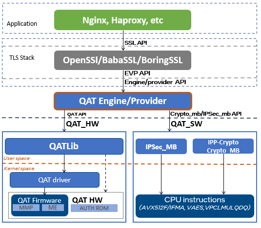

# Intel&reg; QuickAssist Technology(QAT) OpenSSL Engine and Provider
Intel&reg; QuickAssist Technology OpenSSL\* Engine (QAT_Engine) supports
acceleration through the QAT hardware (via the QAT_HW path) and through
Optimized Software using the Intel instruction set (via the QAT_SW Path
from 3rd Generation Intel&reg; Xeon&reg; Scalable Processors family).

The image below illustrates the high-level software architecture of the
QAT OpenSSL Engine. Applications such as NGINX and HAProxy are common applications
which interfaces to crypto libraries like OpenSSL\* and its fork like
Tongsuo(BabaSSL)\*, BoringSSL\*, etc. OpenSSL\* is a toolkit for TLS/SSL protocols and
has developed a modular system to plugin device-specific engines and provider.
Depending on the particular use case, the QAT OpenSSL Engine can be configured
to accelerate operations using QAT Hardware, QAT Software, or both, depending on
the platform, to meet your specific acceleration needs. QAT OpenSSL Engine supports
both the Engine interface (up to OpenSSL 3.x; not supported in OpenSSL 4.0 and later)
and the Provider interface (`qatprovider`, recommended for OpenSSL 3.x and later). The
Provider is built by default; pass `--enable-qat_engine` at build time to opt into the
legacy Engine interface instead. See
[QAT Provider Interface](docs/qat_common.md#qat-provider-interface) for details.

<p align=center>

</p>

## Features
Features of the QAT_Engine are described [here](docs/features.md).

## Limitations and Known Issues
Limitations and known issues for the QAT_Engine are described [here](docs/limitations.md).

## Requirements
- [Hardware Requirements](docs/hardware_requirements.md)
- [Software Requirements](docs/software_requirements.md)

## Installation Instructions
Installation instructions, including build steps for the Engine and Provider
interfaces across QAT_HW, QAT_SW and Co-existence configurations, are described [here](docs/install.md)

## Testing
<details>
<summary>Verify QAT Provider and Engine loading</summary>

### Verify QAT Provider loading
QAT Provider (qatprovider) is the default and recommended interface for OpenSSL 3.x and later.
Run the following to verify `qatprovider` is loaded correctly. Always load the `default` provider
alongside `qatprovider` to ensure complete algorithm coverage.

```text
cd /path/to/openssl_install/bin
./openssl list -providers -provider qatprovider -provider default
```

Expected output will list `qatprovider` with its name, version and loaded status.

> **Note:** Always activate the `default` provider alongside `qatprovider` — either via
> `-provider default` on the command line or by adding it to your `openssl.cnf`.
> See [QAT Provider Interface](docs/qat_common.md#qat-provider-interface) for details.

### Verify QAT Engine loading
Use the `--enable-qat_engine` flag to build the legacy QAT Engine.Run the following
command to verify that the QAT Engine is loaded correctly. This command should not be
used to determine QAT Engine capabilities, as it does not display all the algorithms
supported by the QAT Engine.

```text
cd /path/to/openssl_install/bin
./openssl engine -t -c -v qatengine
```

qat_hw target output will be:
```text
(qatengine) Reference implementation of QAT crypto engine(qat_hw) <qatengine version>
 [RSA, DSA, DH, AES-128-CBC-HMAC-SHA1, AES-128-CBC-HMAC-SHA256,
 AES-256-CBC-HMAC-SHA1, AES-256-CBC-HMAC-SHA256, TLS1-PRF, HKDF, X25519, X448]
    [ available ]
    ENABLE_EXTERNAL_POLLING, POLL, SET_INSTANCE_FOR_THREAD,
    GET_NUM_OP_RETRIES, SET_MAX_RETRY_COUNT, SET_INTERNAL_POLL_INTERVAL,
    GET_EXTERNAL_POLLING_FD, ENABLE_EVENT_DRIVEN_POLLING_MODE,
    GET_NUM_CRYPTO_INSTANCES, DISABLE_EVENT_DRIVEN_POLLING_MODE,
    SET_EPOLL_TIMEOUT, SET_CRYPTO_SMALL_PACKET_OFFLOAD_THRESHOLD,
    ENABLE_INLINE_POLLING, ENABLE_HEURISTIC_POLLING,
    GET_NUM_REQUESTS_IN_FLIGHT, INIT_ENGINE, SET_CONFIGURATION_SECTION_NAME,
    ENABLE_SW_FALLBACK, HEARTBEAT_POLL, DISABLE_QAT_OFFLOAD
```

qat_sw target output will be:
```text
(qatengine) Reference implementation of QAT crypto engine(qat_sw) <qatengine version>
 [RSA, id-aes128-GCM, id-aes192-GCM, id-aes256-GCM, X25519]
     [ available ]
     ENABLE_EXTERNAL_POLLING, POLL, ENABLE_HEURISTIC_POLLING,
     GET_NUM_REQUESTS_IN_FLIGHT, INIT_ENGINE
```

Detailed information about the engine specific messages is available [here](docs/engine_specific_messages.md).
Also `./openssl engine -t -c -vvvv qatengine` gives brief description about each ctrl command.

</details>
<details>
<summary>Test using OpenSSL* speed utility</summary>

### Test using OpenSSL\* speed utility


**QAT Provider (`-provider qatprovider -provider default`)**

```text
cd /path/to/openssl_install/bin

qat_hw

* RSA 2K Sign/Verify
  taskset -c 1 ./openssl speed -provider qatprovider -provider default -elapsed -async_jobs 72 rsa2048
* ECDH P-256 Compute Key
  taskset -c 1 ./openssl speed -provider qatprovider -provider default -elapsed -async_jobs 72 ecdhp256
* ECDSA P-256 Sign/Verify
  taskset -c 1 ./openssl speed -provider qatprovider -provider default -elapsed -async_jobs 72 ecdsap256
* AES-256-GCM
  taskset -c 1 ./openssl speed -provider qatprovider -provider default -elapsed -async_jobs 72 -evp aes-256-gcm

qat_sw

* RSA 2K Sign/Verify
  taskset -c 1 ./openssl speed -provider qatprovider -provider default -elapsed -async_jobs 8 rsa2048
* ECDH X25519 Compute Key
  taskset -c 1 ./openssl speed -provider qatprovider -provider default -elapsed -async_jobs 8 ecdhx25519
* ECDSA P-256 Sign/Verify
  taskset -c 1 ./openssl speed -provider qatprovider -provider default -elapsed -async_jobs 8 ecdsap256
* AES-256-GCM
  taskset -c 1 ./openssl speed -provider qatprovider -provider default -elapsed -evp aes-256-gcm
```
**QAT Engine (`-engine qatengine`)**

```text
cd /path/to/openssl_install/bin

qat_hw

* RSA 2K Sign/Verify
  taskset -c 1 ./openssl speed -engine qatengine -elapsed -async_jobs 72 rsa2048
* ECDH Compute Key
  taskset -c 1 ./openssl speed -engine qatengine -elapsed -async_jobs 72 ecdhp256
* ECDSA Sign/Verify
  taskset -c 1 ./openssl speed -engine qatengine -elapsed -async_jobs 72 ecdsap256
* AES-128-CBC-HMAC-SHA256
  taskset -c 1 ./openssl speed -engine qatengine -elapsed -async_jobs 72 -evp aes-128-cbc-hmac-sha256

qat_sw

* RSA 2K Sign/Verify
  taskset -c 1 ./openssl speed -engine qatengine -elapsed -async_jobs 8 rsa2048
* ECDH X25519 Compute Key
  taskset -c 1 ./openssl speed -engine qatengine -elapsed -async_jobs 8 ecdhx25519
* ECDH P-256 Compute Key
  taskset -c 1 ./openssl speed -engine qatengine -elapsed -async_jobs 8 ecdhp256
* ECDSA P-256 Sign/Verify
  taskset -c 1 ./openssl speed -engine qatengine -elapsed -async_jobs 8 ecdsap256
* ECDH P-384 Sign/Verify
  taskset -c 1 ./openssl speed -engine qatengine -elapsed -async_jobs 8 ecdhp384
* ECDSA P-384 Sign/Verify
  taskset -c 1 ./openssl speed -engine qatengine -elapsed -async_jobs 8 ecdsap384
* AES-128-GCM
  taskset -c 1 ./openssl speed -engine qatengine -elapsed -evp aes-128-gcm
```

Note: Run the test without `-engine qatengine` or `-provider qatprovider` for each algorithm to
compare against OpenSSL\* software. This covers key algorithms; additional algorithms can be tested
by changing the algo parameter. Additional provider test commands are described in
[docs/qat_common.md](docs/qat_common.md#openssl-provider-support).
</details>
<details>
<summary>Test using inbuilt testapp utility</summary>

### Test using inbuilt testapp utility

> **Note:** The `testapp` utility supports QAT Engine (`qatengine`) & QAT Provider interfaces.

```text
cd /path/to/qat_engine or /path/to/qat_provider
make test
./testapp.sh <QAT_HW|QAT_SW> <provider|engine>
Examples:
  ./testapp.sh QAT_HW provider
  ./testapp.sh QAT_SW provider
  ./testapp.sh QAT_HW engine
  ./testapp.sh QAT_SW engine
```
The `testapp.sh` script will run the corresponding functional tests supported
by QAT_HW and QAT_SW. Please note that the QAT Engine should be built with
that support for the tests.

Additional information for testapp tests available with the help option
`./testapp -help`
</details>

## Application integration & Case studies
Links to additional content is available [here](docs/apps.md).

## Troubleshooting
Troubleshooting information is available [here](docs/troubleshooting.md).

## Licensing
* [BSD-3-Clause License](LICENSE)

## Legal
Intel, Intel Atom, and Xeon are trademarks of
Intel Corporation in the U.S. and/or other countries.

\*Other names and brands may be claimed as the property of others.

Copyright &copy; 2016-2026, Intel Corporation. All rights reserved.
