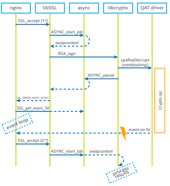

# Using the OpenSSL\* asynchronous mode 'ASYNC_JOB' infrastructure

Asynchronous operation utilizes the OpenSSL\* asynchronous mode (`ASYNC_JOB`
infrastructure) introduced in OpenSSL\* version 1.1.0.  In the
OpenSSL\* master branch this infrastructure was augmented to provide an
additional `callback` method by which the OpenSSL\* Engine can be notified
of crypto operation request completions by the hardware accelerator. This
additional method can be used if you think that using the alternative
`file descriptor` method descriptor is too costly in terms of CPU cycles
or in some context where a file descriptor is not appropriate.

The QAT OpenSSL\* Engine build system will automatically detect whether the
OpenSSL\* version being built against supports this additional `callback` method.
If so, the QAT OpenSSL\* Engine code will use the `callback`
mechanism for job completion rather than the `file descriptor`
mechanism if a `callback` function has been set. If a `callback` has not
been set then the `file descriptor` method will be used.

For further details on using the OpenSSL\* asynchronous mode infrastructure please
see the OpenSSL\* online documentation located at:
- <https://www.openssl.org/docs/manmaster/man3/ASYNC_start_job.html>
- <https://www.openssl.org/docs/manmaster/man3/ASYNC_WAIT_CTX_new.html>.
