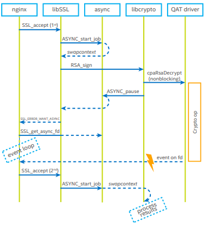

# Using the OpenSSL\* `ASYNC_JOB` Infrastructure

QAT Engine (`qatengine`) and QAT Provider (`qatprovider`) both support
asynchronous operations through the OpenSSL\* `ASYNC_JOB` infrastructure,
which was introduced in OpenSSL\* 1.1.0. Applications use the same OpenSSL
asynchronous APIs with either module.

The OpenSSL\* `ASYNC_JOB` infrastructure was later extended with a `callback`
method that notifies the QAT acceleration code when cryptographic operations
complete. This method can be used when the alternative file descriptor method
is too costly in terms of CPU cycles or when a file descriptor is unsuitable.

The project build system automatically detects whether the
OpenSSL\* version being built against supports this additional `callback` method.
If so, the QAT acceleration code uses the `callback`
mechanism for job completion rather than the `file descriptor`
mechanism if a `callback` function has been set. If a `callback` has not
been set, the `file descriptor` method is used.

For further details on using the OpenSSL\* asynchronous mode infrastructure,
see the OpenSSL\* online documentation:
- <https://www.openssl.org/docs/manmaster/man3/ASYNC_start_job.html>
- <https://www.openssl.org/docs/manmaster/man3/ASYNC_WAIT_CTX_new.html>.
