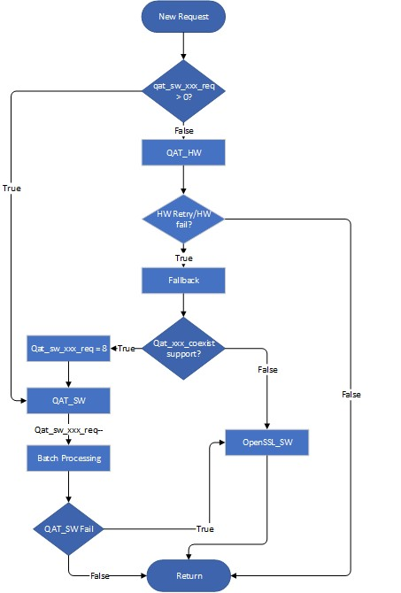

# QAT_HW and QAT_SW Co-existence

Intel&reg; QAT OpenSSL\* Engine supports QAT_HW and QAT_SW Co-existence build
with both QAT_HW and QAT_SW dependent libraries(QAT Driver, crypto_mb and
ipsec_mb) linked in the qatengine.so library. This support can be enabled at
build time when both QAT_HW flag `--with-qat_hw_dir=/path/to/QAT_Driver`
and QAT_SW flag `--enable-qat_sw` configured together in the build configure
option.

If the platform has support for both QAT_HW and QAT_SW, the default
behavior is to accelerate asymmetric algorithms and Symmetric chained ciphers
using QAT Hardware and Symmetric GCM Ciphers using QAT Software. If the platform
doesn't have QAT Hardware support then it will use QAT_SW Acceleration for
QAT_SW asymmetric algorithms that are supported in the qatengine.

The default behavior can be changed using corresponding algorithm's enable
flags (eg:--enable-qat_sw_rsa) in which case the individual algorithms enabled
(either qat_hw or qat_sw) in the build configure will get accelerated.

For the algorithms RSA2K/3K/4K, ECDHP256/P384/X25519 & ECDSAP384 to reach
better performance, QAT Engine uses both QAT_HW and QAT_SW for acceleration
when QAT_HW capacity is reached with co-existence build. The Control flow is
mentioned in the Figure below.

<p align=center>

</p>


## Run time Co-existence configuration using HW & SW algorithm bitmap
Intel&reg; QAT OpenSSL\* Engine supports a runtime mechanism to dynamically choose
the QAT_HW or QAT_SW or both for each algorithm, using QAT_HW and QAT_SW dependent
libraries linked in a single qatengine.
It can be accomplished through two ENGINE ctrl commands:
**HW_ALGO_BITMAP** & **SW_ALGO_BITMAP**,
and the bit map of each algorithm is defined below:
| Algorithm | Bit | HW or SW supported(Priority) |
| :- | :- | :-: |
| RSA | 0x00001 | Both (HW > SW) |
| DSA | 0x00002 | HW |
| DH | 0x00004 | HW |
| ECDSA | 0x00008 | Both (HW > SW) |
| ECDH | 0x00010 | Both (HW > SW) |
| ECX25519 | 0x00020 | Both (HW > SW) |
| ECX448 | 0x00040 | HW |
| PRF | 0x00080 | HW |
| HKDF | 0x00100 | HW |
| SM2(ECDSA) | 0x00200 | HW > SW |
| AES_GCM | 0x00400 | Both (SW > HW) |
| AES_CBC_HMAC_SHA | 0x00800 | HW |
| SM4_CBC | 0x01000 | Both (HW > SW) |
| CHACHA_POLY | 0x02000 | HW |
| SHA3 | 0x04000 | HW |
| SM3 | 0x08000 | SW |
| SM4-GCM | 0x10000 | SW |
| SM4-CCM | 0x20000 | SW |
| AES-CCM | 0x40000 | HW |

## QAT_HW & QAT_SW Co-existence recommended settings and working mechanism

1. For those algorithms that can achieve stronger performance with QAT_SW, we
   only use QAT_SW by default. These algorithms include:`AES-GCM`, `ECDSA-P256`,
   `SM4-CBC(256-1024 bytes)`.
2. For those algorithms that can achieve stronger performance with QAT_HW, the
   request will be offloaded to QAT_HW first, and after QAT_HW capacity is
   reached, it will be processed through QAT_SW. These algorithms include:
   `RSA-2K/3K/4K`, `ECDSA-P384`, `ECDH-P256/P384/X25519`, `SM4-CBC(2048-16384 bytes)`.
3. It is recommended to set "LimitDevAccess" to 0 in QAT_HW driver config file to
   utilize all the available device per process for Co-existence mode to fully
   utilize QAT_HW first and then utilize QAT_SW.
4. For SM4-CBC, It is recommended to set "CyNumConcurrentSymRequests" to be
   smaller to trigger QAT HW `RETRY`. And The number of async jobs should be
   appropriate, Number of async requests has to be maintained properly to
   achieve optimal performance. The following is a best known configuration(
   tested with 1 QAT DEV using OpenSSL speed App on SPR and the
   "CyNumConcurrentSymRequests" is set to 64):
   | Packet Length | 1 Multi | 2 Multi | 4 Multi | 8-64 Multi |
   | :---: | :---: | :---: | :---: | :---: |
   | 16 bytes | 64 async jobs | 64 async jobs | 64 async jobs  | 64 async jobs  |
   | 64 bytes | 64 async jobs  | 64 async jobs  | 64 async jobs  | 64 async jobs  |
   | 256 bytes | 96 async jobs  | 96 async jobs  | 96 async jobs  | 96 async jobs  |
   | 1024 bytes | 96 async jobs  | 96 async jobs  | 96 async jobs  | 96 async jobs  |
   | 8192 bytes | 48 async jobs  | 88 async jobs  | 136 async jobs  | 176 async jobs  |
   | 16384 bytes | 48 async jobs  | 88 async jobs  | 152 async jobs  | 176 async jobs  |

**Note: ECDH-SM2 is included in ECDH SW group.**

If one algorithm is expected to be enabled, the preconditions are:
1. Supported in configuration, e.g., `--enable-qat_hw_gcm`.
2. Enabled in [default algorithm] directive, e.g., `RSA/EC/DH/DSA/CIPHER/PKEY/DIGEST/ALL`.

Algorithms that are enabled in HW_ALGO_BITMAP will gets accelerated via QAT_HW method and algorithms that are enabled in SW_ALGO_BITMAP will gets accelerated via QAT_SW method. If an algorithm is enabled in both HW_ALGO_BITMAP and SW_ALGO_BITMAP then the one that has highest priority (listed above) will be accelerated. If none is enabled, OpenSSL SW will be used.

**Note:** 
1. The default HW_ALGO_BITMAP and SW_ALGO_BITMAP value for each algorithm are set to 0xFFFF, which means all algorithms are enabled by default. If both HW&SW bitmap aren't set, QAT_Engine will offload the algorithm depending on the configuration and [default algorithm] setup.
2. The XX_ALGO_BITMAP commands are only workable when the corresponding offload mode is enabled, e.g. SW_ALGO_BITMAP is supported only if the QAT_SW is enabled.
3. In case the QAT_HW&QAT_SW are both enabled, it's recommended to set both HW_ALGO_BITMAP and SW_ALGO_BITMAP in the meantime, disabling the unnecessary and enabling the necessary offload mode for each algorithm.
4. The offload mode with higher priority must be disabled when you want to enable the lower priority one for each algorithm.

**Example 1:**  
Algorithm combination to be enabled: RSA(HW), ECDSA(HW), ECDH(SW), ECX25519(HW), SM2(SW), AES-GCM(SW). Make sure these algorithms are supported in configuration and already set
`RSA,EC,PKEY,CIPHER` or `ALL` in the [default algorithm].
```
HW_ALGO_BITMAP: RSA(0x0001) + ECDSA(0x0008) + ECX25519(0x0020) = 0x0029.
SW_ALGO_BITMAP: ECDH(0x0010) + SM2(0x0200) + AES-GCM(0x0400) = 0x0610.
```
* openssl.conf
```
[qatengine_section]
engine_id = qatengine
default_algorithms = ALL
HW_ALGO_BITMAP = 0x0029
SW_ALGO_BITMAP = 0x0610
```

* testapp
```
./testapp -engine qatengine -async_jobs 1 -c 1 -n 1 -nc 1 -v -hw_algo 0x0029 -sw_algo 0x0610 [test_case]
```

**Example 2:**  
Lower priority Algorithms need to be enabled: RSA(SW), AES-GCM(HW):
```
HW_ALGO_BITMAP: 0xFFFF - RSA(0x0001) = 0xFFFE. # Disable the RSA HW BITMAP because it has higher priority.
SW_ALGO_BITMAP: 0xFFFF - AES-GCM(0x0400) = 0xFBFF. # Disable the AES-GCM SW BITMAP because it has higher priority.
```
