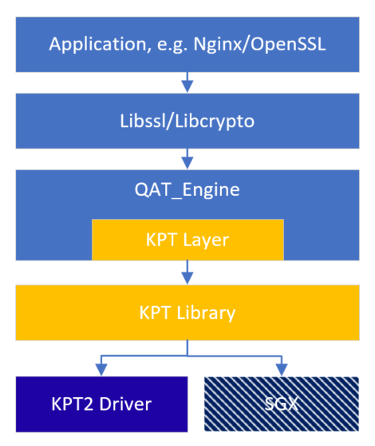

# Key Protection Technology Library

The KPT2.0 capability is delivered through the KPT Library which is placed in the QAT_Engine repository. It can provide KPT2.0 functionalities, like special key file parse, KPT init/finish, asymmetric crypto offload etc. And the library will leverage other Intel security technologies, e.g. Software Guard Extensions(SGX) to provide more security services in the future.

## **Division of the work**
* QAT_ENGINE: Control Path
    * Async job control
    * QAT resource management
    * KPT Layer between QAT_Engine and KPT Library: qat_hw_kpt.c

* KPT_LIB: Data Path
    * WPK load and parse
    * KPT initialization/finish
    * Crypto offload

## **Environment Setup**
### Requirements
* QuickAssist Technology Driver for Intel® Xeon® Scalable Processor family with Intel® QAT Gen4/Gen4m Platform
* OpenSSL 1.1.1x & 3.0.x

### Build
  This Library is built along with qatengine build when KPT is enabled using the configure flag `--enable-qat_hw_kpt`. KPT debugs can be enabled by passing "KPT_DEBUG" or "KPT_WARN" in the CFLAGS.
