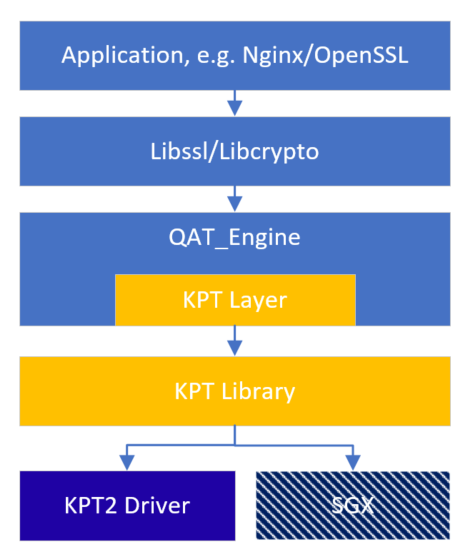

# Key Protection Technology Library

The KPT 2.0 capability is delivered through the KPT library in the QAT_Engine
repository. It provides KPT 2.0 functionality such as parsing special key files,
initializing and finalizing KPT, and offloading asymmetric cryptography. The
library may use other Intel security technologies, such as Software Guard
Extensions (SGX), to provide additional security services in the future.

## **Responsibilities**
* QAT Engine: Control Path
    * Async job control
    * QAT resource management
    * KPT layer between QAT Engine and KPT library: `qat_hw_kpt.c`

* KPT_LIB: Data Path
    * WPK load and parse
    * KPT initialization/finish
    * Crypto offload

## **Environment Setup**
### Requirements
* QuickAssist Technology Driver for Intel® Xeon® Scalable Processor family with Intel® QAT Gen4/Gen4m Platform
* OpenSSL 1.1.1x & 3.0.x

### Build
    This library is built with `qatengine` when KPT is enabled using the
    `--enable-qat_hw_kpt` configure flag. Enable KPT debug logging by passing
    `KPT_DEBUG` or `KPT_WARN` in `CFLAGS`.
